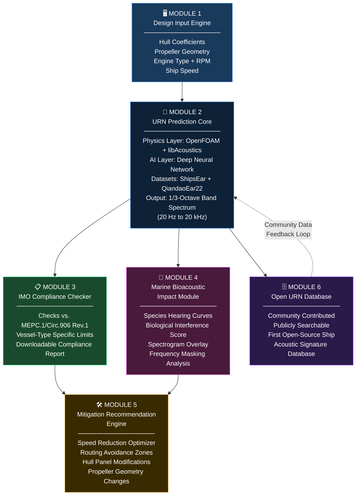

<!-- SONARIS README.md -->

<div align="center">

# 🌊 SONARIS
### Ship-Ocean Noise Acoustic Radiated Intelligence System

[](https://opensource.org/licenses/MIT)
[]()
[](https://www.python.org/)
[]()
[]()
[](CONTRIBUTING.md)

<br/>

*The world's first open-source platform to predict ship underwater radiated noise, verify IMO compliance, and map acoustic harm to marine mammals. Free for every shipyard, researcher, and environmental organization on Earth.*

<br/>

---

</div>

## 🎯 Mission

Every day, more than 90,000 commercial vessels move through the world's oceans, each one generating a wall of underwater noise that travels hundreds of kilometers through water. This anthropogenic din (driven by propeller cavitation, engine vibration, and hull-induced turbulence) has fundamentally altered the acoustic environment that marine life depends on for survival. The IMO's MEPC.1/Circ.906 Rev.1 (2024) guidelines call upon flag states and shipyards to actively manage a vessel's Underwater Radiated Noise (URN), yet as of today, **no free, open, and scientifically rigorous tool exists to help them do so.** Expensive proprietary software remains locked behind paywalls that exclude developing-nation shipyards, independent researchers, and the NGOs fighting hardest for ocean health. SONARIS was built to close that gap. It is a hybrid physics-AI platform that accepts a ship's design parameters and returns a complete acoustic signature, an IMO compliance verdict, and a biological impact score. Free, open, and ready to use by anyone in the world.

---

## 🔴 Why SONARIS Exists

### 1. The Regulatory Gap

The IMO's **MEPC.1/Circ.906 Rev.1 (2024)** is the international community's most current framework for managing ship underwater noise. It recommends that new ships be designed with URN targets defined by vessel type, and classification societies including Lloyd's Register, DNV, and Bureau Veritas have begun establishing noise notations accordingly. But there is no standardized, freely accessible computational tool that shipyards can use to predict URN during the design phase, before a ship is ever built. Today, compliance depends on expensive tank testing, post-delivery sea trials, or proprietary acoustic suites that cost tens of thousands of dollars per license. The regulatory framework exists. The will to act is growing. The tools to actually do it are not accessible to most of the world.

### 2. The Environmental Crisis

Marine mammals evolved in a pre-industrial ocean where sound was the primary medium of survival: for navigation, predation, reproduction, and social bonding. Blue whales communicate across ocean basins. Bottlenose dolphins navigate using biosonar. Right whales call to potential mates across hundreds of kilometers of open water. Ship noise, concentrated in the 10 Hz to 1000 Hz band where these species communicate, does not merely disturb them. It **masks, disrupts, and in chronic cases physiologically harms** them. Studies have documented measurable changes in humpback whale song structure in active shipping corridors. North Atlantic Right Whale populations, already critically endangered, face communication interference across their entire historic range. The ocean is getting louder every decade, and the biological cost of that is one of the most underreported environmental crises of our time.

### 3. The Access Gap

A world-class shipyard in Norway or South Korea can afford acoustic consultancy fees and proprietary software licenses. A shipyard in India, Brazil, or the Philippines generally cannot. An independent acoustics researcher at a university in West Africa certainly cannot. The environmental NGO monitoring shipping lanes near a marine protected area has no tool at all. SONARIS is built on the belief that **the physics of sound does not respect economic inequality, and the tools to understand it should not either.** MIT license. Permanently free. Always open.

---

## ⚡ What Makes SONARIS Different

Most underwater acoustic tools are black boxes. They take inputs, return a number, and offer no insight into the physics behind it. SONARIS works from a different premise: **the acoustic fingerprint of a ship is not random noise. It is a structured signal with harmonic content, spectral envelopes, tonal peaks, and masking relationships. That is exactly what music theory and audio signal processing have spent centuries formalizing.**

### The Music-Theory-to-Acoustics Methodology

A ship's acoustic signature can be analyzed the same way a sound engineer analyzes a recording: not as noise to be measured, but as a signal to be understood. SONARIS applies this directly across all its core modules.

| Music/Audio Concept | How SONARIS Uses It |
|---|---|
| **MFCC (Mel-Frequency Cepstral Coefficients)** | Characterizes ship acoustic signatures in a perceptually weighted frequency space. The same representation used in speech and music recognition, applied here to classify vessel types and operational states from raw hydrophone data |
| **Harmonic Overlap Analysis** | Identifies tonal peaks in propeller blade-rate harmonics and engine firing frequencies, then maps their overlap with the fundamental communication frequencies of target marine mammal species |
| **Frequency Masking** | Quantifies how ship noise energy in a given band renders biologically critical signals (whale calls, dolphin clicks) inaudible, using psychoacoustic masking models adapted from audio engineering |
| **Spectral Envelope Modeling** | Fits parametric models to the 1/3-octave URN spectrum, enabling interpolation, extrapolation to unmeasured speeds, and comparison across vessel types |
| **Destructive Interference Principles** | Informs active noise control recommendations: hull panel anti-vibration treatments modeled on acoustic phase-cancellation logic |

No other URN prediction tool in the world uses this synthesis. It is SONARIS's core scientific identity.

---

## 🏗️ System Architecture



**Data Flow Summary:**
1. User inputs ship design parameters via the web UI or Python API
2. The URN Prediction Core generates a full acoustic spectrum using hybrid physics-AI modeling
3. The spectrum is simultaneously evaluated by the IMO Compliance Checker and the Marine Bioacoustic Impact Module
4. Both outputs feed into the Mitigation Engine, which returns ranked, actionable design recommendations
5. All predicted signatures (verified or unverified) can be contributed to the Open URN Database, which feeds back into model training

---

## 📦 Modules

### Module 1 — Design Input Engine

**What it does:** Provides a clean web interface (Streamlit) and Python API for ingesting all parameters that define a ship's acoustic profile at the design stage.

**Inputs:** Hull form coefficients (Cb, Cp, L/B, T), propeller geometry (diameter, blade count, pitch ratio, skew angle, advance ratio), engine specifications (type, cylinder count, rated RPM, MCR power), and operating speed in knots.

**Outputs:** A validated, structured parameter dictionary passed to the URN Prediction Core.

**Scientific basis:** Based on established Naval Architecture design parameter conventions; input ranges validated against ITTC (International Towing Tank Conference) standards for propeller geometry.

---

### Module 2 — URN Prediction Core (Hybrid AI + Physics)

**What it does:** The scientific heart of SONARIS. Produces a full 1/3-octave band underwater radiated noise spectrum from 20 Hz to 20 kHz, covering the complete frequency range relevant to both IMO compliance and marine mammal biology.

**Inputs:** Validated design parameters from Module 1.

**Outputs:** A 1/3-octave URN spectrum (dB re 1 µPa @ 1m), tonal peak identification, propeller blade-rate frequency harmonics, and confidence intervals on each band prediction.

**Scientific basis:**
- *Physics layer:* OpenFOAM computational fluid dynamics simulates the propeller inflow field; libAcoustics extracts the far-field acoustic radiation using the Ffowcs Williams-Hawkings (FW-H) equation, which is the gold standard for aeroacoustic and hydroacoustic radiation prediction.
- *AI layer:* A deep neural network (1D-CNN + LSTM hybrid) trained on the ShipsEar and QiandaoEar22 datasets learns the residual mapping between idealized CFD output and real-world measured signatures, correcting for sea-state variability, hull roughness, and operational factors not captured by first-principles simulation.
- *MFCC feature extraction* is applied to training data to represent ship signatures in a perceptually meaningful frequency space, improving model generalization across vessel types.

---

### Module 3 — IMO Compliance Checker

**What it does:** Automatically evaluates the predicted URN spectrum against the vessel-type-specific noise targets in IMO MEPC.1/Circ.906 Rev.1 (2024) and generates a formatted compliance report.

**Inputs:** URN spectrum from Module 2, vessel type classification (cargo, tanker, passenger, etc.).

**Outputs:** A pass/fail compliance assessment per frequency band, a downloadable PDF compliance report, and a decibel-margin analysis showing exactly how much headroom or exceedance exists in each band.

**Scientific basis:** IMO MEPC.1/Circ.906 Rev.1 (2024) noise level targets, supplemented by DNV GL noise notation criteria for vessels seeking acoustic classification.

---

### Module 4 — Marine Bioacoustic Impact Module *(Core Differentiator)*

**What it does:** Maps the predicted ship noise spectrum onto the hearing sensitivity and communication frequency ranges of five marine mammal functional hearing groups and produces a quantitative Biological Interference Score (BIS) for each group.

**Inputs:** URN spectrum from Module 2; published audiogram data for low-frequency cetaceans (baleen whales), mid-frequency cetaceans (dolphins, toothed whales), high-frequency cetaceans (porpoises), pinnipeds in water (seals, sea lions), and sirenians (manatees, dugongs).

**Outputs:**
- Biological Interference Score (BIS) per species group (0 to 100 scale, where 100 = complete masking of the primary communication band)
- Spectrogram overlay visualization: ship noise vs. species communication envelope
- Frequency masking analysis: proportion of a species' vocal repertoire rendered inaudible at a given received level
- Harmonic overlap report: tonal peaks in the ship signature that fall within +/- 1/3 octave of recorded call frequencies

**Scientific basis:** NOAA marine mammal acoustic criteria; Southall et al. (2019) noise exposure criteria; Au & Hastings (2008) audiogram compilations; psychoacoustic masking models adapted from Moore (2012).

---

### Module 5 — Mitigation Recommendation Engine

**What it does:** Takes the compliance gaps and biological impact scores and generates a prioritized set of design and operational modifications to bring the vessel into compliance and reduce ecological harm.

**Inputs:** Compliance gap analysis from Module 3; BIS scores from Module 4; original design parameters.

**Outputs:** Ranked mitigation recommendations covering optimized speed profiles, alternate routing around marine protected areas, propeller geometry adjustments (skew, rake, pitch ratio), hull panel damping treatment specifications, and cavitation-suppression design strategies.

**Scientific basis:** ITTC propeller noise reduction guidelines; Carlton (2012) propeller blade design for noise optimization; IMO speed reduction studies.

---

### Module 6 — Open URN Database

**What it does:** Hosts the world's first open-source, community-contributed database of ship underwater acoustic signatures, searchable by vessel type, propulsion system, speed, and frequency band.

**Inputs:** Community submissions of measured or predicted URN spectra with associated ship metadata.

**Outputs:** A publicly queryable dataset for research, model validation, regulatory benchmarking, and fleet-wide trend analysis.

**Scientific basis:** Modeled on FAIR data principles (Findable, Accessible, Interoperable, Reusable); data quality validated against ShipsEar and QiandaoEar22 baseline distributions before ingestion.

---

## 👥 Who This Is For

| Audience | How SONARIS Serves Them |
|---|---|
| **Shipyards and Naval Architects** | Predict and optimize URN at the design stage, before steel is cut, reducing costly post-delivery retrofits |
| **Classification Societies** (Lloyd's Register, DNV, BV, ABS) | A standardized, reproducible URN assessment tool to support acoustic noise notation verification |
| **Environmental NGOs** (WWF, Ocean Conservation Trust, IFAW) | Quantify the biological impact of shipping traffic on marine mammal populations using a defensible, published methodology |
| **Naval Defense Organizations** | Acoustic signature modeling for vessel design and fleet management; open architecture allows custom extension |
| **Port Authorities** | Evaluate the noise contribution of different vessel types calling at their ports; model quiet shipping incentive programs |
| **Ocean Researchers and Academics** | Open-source, reproducible acoustic modeling platform with an accessible URN database. No license fees, no barriers |
| **Regulatory Bodies** (IMO, Flag State Administrations) | A reference implementation of MEPC.1/Circ.906 Rev.1 compliance assessment that supports policy development with quantitative data |

---

## 🗺️ Roadmap

### Phase 0 — Foundation *(Current)*
- [x] Project architecture designed and documented
- [x] Technical stack selected and validated
- [x] Dataset sources identified (ShipsEar, QiandaoEar22, IMO guidelines, audiograms)
- [x] README and project identity established
- [ ] GitHub repository initialized with folder structure
- [ ] Development environment configured (OpenFOAM, PyTorch, Streamlit)
- [ ] Core data pipeline: raw hydrophone audio to 1/3-octave spectrum

### Phase 1 — URN Prediction Core *(Q2 2025)*
- [ ] Physics layer: OpenFOAM + libAcoustics propeller noise simulation pipeline
- [ ] AI layer: 1D-CNN + LSTM model trained on ShipsEar dataset
- [ ] MFCC feature extraction pipeline for ship audio signatures
- [ ] Cross-validation against QiandaoEar22 dataset
- [ ] Benchmark: prediction accuracy within +/- 3 dB across 1/3-octave bands
- [ ] Module 1 (Design Input Engine) — Streamlit UI v1.0
- [ ] Module 2 (URN Prediction Core) — Python API v1.0

### Phase 2 — Compliance + Bioacoustics *(Q3 2025)*
- [ ] Module 3 (IMO Compliance Checker) — Full MEPC.1/Circ.906 Rev.1 rule set implemented
- [ ] Downloadable PDF compliance report generation
- [ ] Module 4 (Bioacoustic Impact) — Five functional hearing group audiogram integration
- [ ] Biological Interference Score (BIS) algorithm validated against published masking studies
- [ ] Spectrogram overlay visualization: ship noise vs. whale/dolphin communication bands
- [ ] Harmonic overlap analysis engine
- [ ] Module 5 (Mitigation Engine) — v1.0 recommendation set

### Phase 3 — Community + Scale *(Q4 2025 to 2026)*
- [ ] Module 6 (Open URN Database) — Public launch with seed data
- [ ] Community contribution pipeline with data quality validation
- [ ] REST API for programmatic access to all modules
- [ ] Integration with AIS ship tracking data for real-time fleet noise estimation
- [ ] Peer-reviewed methodology paper submitted to Journal of the Acoustical Society of America
- [ ] Formal outreach to IMO, Lloyd's Register, and WWF for adoption and feedback
- [ ] Multi-language support (Spanish, French, Mandarin, Arabic)
- [ ] PostgreSQL database migration for production scale

---

## 🛠️ Tech Stack

| Category | Tool | Purpose |
|---|---|---|
| **Core Language** | Python 3.10+ | Primary development language across all modules |
| **Deep Learning** | PyTorch | URN prediction neural network (1D-CNN + LSTM architecture) |
| **Machine Learning** | scikit-learn | Feature engineering, model evaluation, cross-validation |
| **Audio/Acoustics** | librosa | MFCC extraction, spectral analysis, 1/3-octave band processing |
| **Signal Processing** | scipy.signal | Filtering, FFT, spectral density estimation |
| **Acoustic Simulation** | mSOUND | 3D acoustic wave propagation modeling |
| **CFD Simulation** | OpenFOAM | Propeller cavitation and turbulent flow simulation |
| **Hydroacoustics** | libAcoustics | FW-H acoustic analogy for far-field URN radiation from CFD data |
| **Web UI** | Streamlit | Design input interface and visualization dashboard |
| **Visualization** | Plotly | Interactive spectrogram overlays and compliance charts |
| **Visualization** | Matplotlib / Seaborn | Publication-quality static plots |
| **Database (dev)** | SQLite | Local URN database and session management |
| **Database (prod)** | PostgreSQL | Production-scale Open URN Database |
| **PDF Generation** | ReportLab | Downloadable IMO compliance reports |
| **Deployment** | Hugging Face Spaces / Streamlit Cloud | Free, accessible public hosting |
| **Version Control** | GitHub | Open-source repository and community collaboration |

---

## 📊 Datasets

SONARIS is built on, and will contribute back to, the following open scientific resources:

### ShipsEar
> Santos-Dominguez, D., Torres-Guijarro, S., Cardenal-Lopez, A., & Pena, A. (2016). **ShipsEar: An underwater vessel noise database.** *Applied Acoustics, 113*, 64-69. https://doi.org/10.1016/j.apacoust.2016.06.008

A foundational public dataset containing recordings from 11 different ship and boat classes captured by hydrophone. Used for training the vessel-type classification and URN spectrum prediction components of Module 2.

### QiandaoEar22
> [Authors]. **QiandaoEar22: A High-Quality Ship-Radiated Noise Dataset.** *arXiv:2406.04354* (2024). https://arxiv.org/abs/2406.04354

A high-quality, recent dataset of ship-radiated underwater noise with rich metadata. Used for cross-validation, model fine-tuning, and benchmarking URN prediction accuracy.

### Marine Mammal Audiograms
> Au, W.W.L., & Hastings, M.C. (2008). **Principles of Marine Bioacoustics.** Springer, New York.

> Southall, B.L., et al. (2019). Marine mammal noise exposure criteria: Updated scientific recommendations for residual hearing effects. **Aquatic Mammals, 45(2)**, 125-232.

Published hearing sensitivity (audiogram) data for five functional hearing groups: low-frequency cetaceans, mid-frequency cetaceans, high-frequency cetaceans, pinnipeds in water, and sirenians. Core data source for Module 4.

### IMO MEPC.1/Circ.906 Rev.1 (2024)
> International Maritime Organization. (2024). **Guidelines for the Reduction of Underwater Noise from Commercial Shipping to Address Adverse Impacts on Marine Life.** *MEPC.1/Circ.906 Rev.1.* IMO, London.

The authoritative international regulatory framework implemented in Module 3. Defines vessel-type-specific URN targets and measurement methodologies.

---

## 🚀 Getting Started

### Prerequisites

- Python 3.10 or higher
- OpenFOAM v2306+ (for the physics simulation layer)
- Git

### Installation

```bash
# 1. Clone the repository
git clone https://github.com/your-username/sonaris.git
cd sonaris

# 2. Create and activate a virtual environment (recommended)
python -m venv venv
source venv/bin/activate        # On Windows: venv\Scripts\activate

# 3. Install Python dependencies
pip install -r requirements.txt

# 4. (Optional) Configure environment variables
cp .env.example .env
# Edit .env with your database path and any API keys

# 5. Launch the SONARIS web interface
streamlit run app.py
```

The application will open in your browser at `http://localhost:8501`.

### Python API (Headless Usage)

```python
from sonaris import URNPredictor, ComplianceChecker, BioacousticImpact

# Define vessel parameters
vessel = {
    "length": 180.0,               # meters
    "beam": 28.0,                  # meters
    "draft": 10.5,                 # meters
    "block_coefficient": 0.78,
    "propeller_diameter": 6.2,     # meters
    "blade_count": 4,
    "pitch_ratio": 0.85,
    "engine_rpm": 120,
    "speed_knots": 14.0,
    "vessel_type": "cargo"
}

# Predict URN spectrum
predictor = URNPredictor()
spectrum = predictor.predict(vessel)

# Check IMO compliance
compliance = ComplianceChecker().evaluate(spectrum, vessel_type="cargo")
print(compliance.report())

# Calculate biological impact
impact = BioacousticImpact().score(spectrum)
print(impact.biological_interference_scores)
```

---

## 🤝 Contributing

SONARIS is built on the belief that the best solutions to global environmental problems come from globally diverse expertise. We are actively looking for contributors from every technical and scientific background.

### Who We Need

- **Naval Architects and Marine Engineers** — Help validate hull-propeller acoustic models and expand the design parameter space
- **Underwater Acousticians** — Challenge and improve the URN prediction methodology; contribute measured data
- **Marine Biologists and Bioacousticians** — Improve species audiogram integration, validate BIS scoring, expand species coverage
- **Machine Learning Engineers** — Improve model architecture, training pipelines, and uncertainty quantification
- **Oceanographers** — Help incorporate propagation environment (depth, temperature, salinity) into URN spread modeling
- **Software Engineers** — API design, database architecture, performance optimization, testing infrastructure
- **Data Scientists** — Feature engineering, exploratory analysis of URN datasets, model benchmarking

### How to Contribute

1. Fork the repository
2. Create a feature branch: `git checkout -b feature/your-contribution`
3. Commit with clear messages: `git commit -m "Add: [description]"`
4. Push and open a Pull Request with a description of the scientific or technical rationale behind your changes

Please read [CONTRIBUTING.md](CONTRIBUTING.md) for our full code standards, testing requirements, and scientific validation protocols before submitting.

> Contributions are held to the same standard as peer-reviewed science. Claims must be justified, methods must be reproducible, and uncertainty must be acknowledged. If you are new to open-source contribution, we will walk you through the process.

---

## 📚 Scientific References

1. **Santos-Dominguez, D., Torres-Guijarro, S., Cardenal-Lopez, A., and Pena, A.** (2016). ShipsEar: An underwater vessel noise database. *Applied Acoustics, 113*, 64-69. https://doi.org/10.1016/j.apacoust.2016.06.008

2. **IMO.** (2024). Guidelines for the Reduction of Underwater Noise from Commercial Shipping to Address Adverse Impacts on Marine Life. *MEPC.1/Circ.906 Rev.1.* International Maritime Organization, London.

3. **Southall, B.L., et al.** (2019). Marine mammal noise exposure criteria: Updated scientific recommendations for residual hearing effects. *Aquatic Mammals, 45(2)*, 125-232. https://doi.org/10.1578/AM.45.2.2019.125

4. **Ffowcs Williams, J.E., and Hawkings, D.L.** (1969). Sound generation by turbulence and surfaces in arbitrary motion. *Philosophical Transactions of the Royal Society A, 264(1151)*, 321-342. *(Theoretical foundation for far-field hydroacoustic radiation in the physics layer)*

5. **Au, W.W.L., and Hastings, M.C.** (2008). *Principles of Marine Bioacoustics.* Springer, New York. https://doi.org/10.1007/978-0-387-47564-1

6. **Ross, D.** (1976). *Mechanics of Underwater Noise.* Pergamon Press. *(Foundational theory for ship-radiated noise source mechanisms)*

7. **Davis, S., and Mermelstein, P.** (1980). Comparison of parametric representations for monosyllabic word recognition in continuously spoken sentences. *IEEE Transactions on Acoustics, Speech, and Signal Processing, 28(4)*, 357-366. *(Original MFCC formulation; basis for SONARIS spectral feature extraction)*

8. **Moore, B.C.J.** (2012). *An Introduction to the Psychology of Hearing* (6th ed.). Brill. *(Psychoacoustic masking models applied in Module 4)*

9. **Carlton, J.** (2012). *Marine Propellers and Propulsion* (3rd ed.). Butterworth-Heinemann. *(Propeller geometry, cavitation, and noise generation; engineering basis for Modules 1 and 5)*

10. **Hildebrand, J.A.** (2009). Anthropogenic and natural sources of ambient noise in the ocean. *Marine Ecology Progress Series, 395*, 5-20. https://doi.org/10.3354/meps08353

---

## 📜 License

```
MIT License

Copyright (c) 2025 SONARIS Project

Permission is hereby granted, free of charge, to any person obtaining a copy
of this software and associated documentation files (the "Software"), to deal
in the Software without restriction, including without limitation the rights
to use, copy, modify, merge, publish, distribute, sublicense, and/or sell
copies of the Software, and to permit persons to whom the Software is
furnished to do so, subject to the following conditions:

The above copyright notice and this permission notice shall be included in all
copies or substantial portions of the Software.

THE SOFTWARE IS PROVIDED "AS IS", WITHOUT WARRANTY OF ANY KIND, EXPRESS OR
IMPLIED, INCLUDING BUT NOT LIMITED TO THE WARRANTIES OF MERCHANTABILITY,
FITNESS FOR A PARTICULAR PURPOSE AND NONINFRINGEMENT. IN NO EVENT SHALL THE
AUTHORS OR COPYRIGHT HOLDERS BE LIABLE FOR ANY CLAIM, DAMAGES OR OTHER
LIABILITY, WHETHER IN AN ACTION OF CONTRACT, TORT OR OTHERWISE, ARISING FROM,
OUT OF OR IN CONNECTION WITH THE SOFTWARE OR THE USE OR OTHER DEALINGS IN THE
SOFTWARE.
```

SONARIS will stay free. That is not a business decision. It is a moral one.

---

## 🧑‍💻 Built By

SONARIS was conceived and is being built by a third-year Naval Architecture and Ocean Engineering student in India who came to this problem from two directions at once.

From engineering: a technical education in hull hydrodynamics, propeller theory, and ship structural design. The physics of how ships move through water, and what that motion radiates outward.

From music: years spent as a composer, developing an intuition for frequency, harmonic structure, spectral texture, and the way sounds interact. How one frequency masks another. How harmonics reinforce or cancel. How a spectrum tells a story.

The overlap between those two backgrounds produced a question that no existing tool had answered: what if you approached the acoustic fingerprint of a ship the way a sound engineer approaches a recording? Not as noise to be measured, but as a signal to be understood?

SONARIS is the answer to that question.

This is not a university assignment. It is a genuine attempt to build something the world actually needs: a free, rigorous, and open tool that helps the people designing, regulating, and protecting the ocean make better decisions. Decisions that will affect whether the creatures that evolved to communicate across the deep can still do so.

> *"The sea, once it casts its spell, holds one in its net of wonder forever."*
> — Jacques Cousteau

If you share that sense of wonder, and the conviction that engineering should be in service of it, welcome to SONARIS.

---

<div align="center">

**🌊 Built for the Ocean. Open to the World. 🌊**

<br/>

*If SONARIS is useful to your work at a shipyard, a research institution, an NGO, or a regulatory body, please star the repository, open an issue, or reach out. Every signal of real-world impact helps grow the community and justify the work.*

<br/>

[](https://github.com/your-username/sonaris)
[](https://github.com/your-username/sonaris)

</div>
